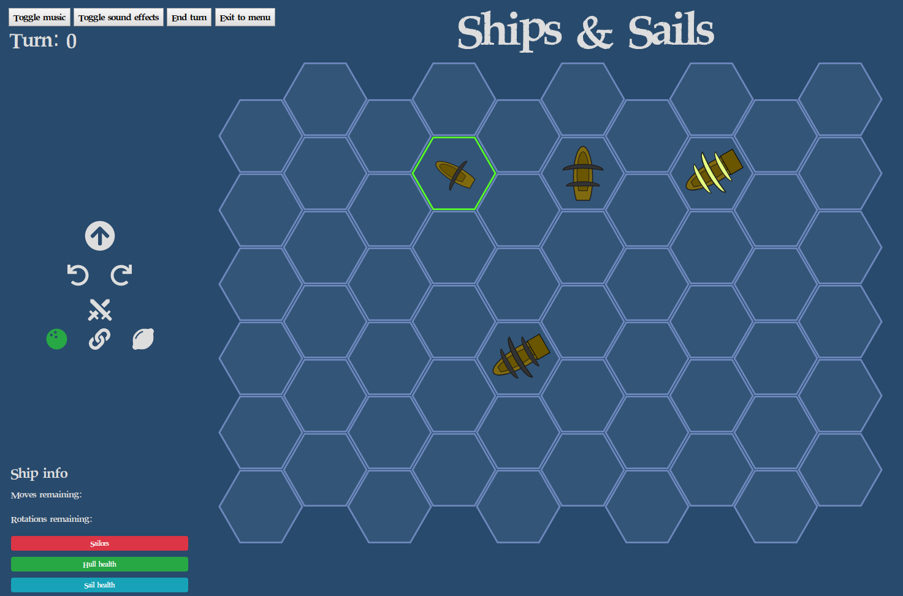

# Ships & Sails

 This work is licensed under a <a rel="license" href="http://creativecommons.org/licenses/by-nc-sa/4.0/">Creative Commons Attribution-NonCommercial-ShareAlike 4.0 International License</a>.

 

## Meta

[Info on hexagonal grids](https://www.redblobgames.com/grids/hexagons/)

## Resources used

### Images

[Most icons](https://fontawesome.com/)

[Attack icon](https://materialdesignicons.com/)

[Our previous ship model](https://forum.chaos-project.com/index.php?topic=563.0)

### Fonts

[Pirates Bay](https://www.dafont.com/font-comment.php?file=piratesbay)
